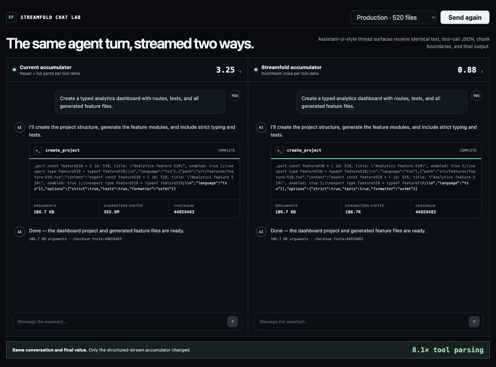

# Streamfold

> Fold any AI stream into reliable state.

[](https://github.com/assistant-ui/streamfold/actions/workflows/ci.yml)

Streamfold is an experimental protocol-neutral incremental streaming state
engine. Its first benchmark investigates a concrete hot path in AI interfaces:
tool-call arguments arriving as many small JSON fragments.

The published npm path executes `JsonStreamParser` in Rust through an embedded
WebAssembly module. It uses neither `napi-rs` nor a duplicated JavaScript parser
at runtime.



## Status

This repository is a benchmark-backed prototype. The incremental scanners retain
structural state and process each incoming byte once. They do not yet materialize the
same partial JavaScript object as `assistant-stream`, so the benchmark demonstrates
the algorithmic opportunity rather than a drop-in replacement.

## Install

```bash
pnpm add streamfold
```

```js
import { createStructuredStream } from "streamfold/assistant-ui";

const toolCalls = createStructuredStream();

for await (const event of assistantStream) {
  const update = toolCalls.push(event);
  if (update && "value" in update) {
    console.log(update.id, update.value);
  }
}
```

## Reproduce

Contributor requirements: Node.js 22+, pnpm 11, and Rustup. The repository
toolchain file installs the required WebAssembly target.

```bash
pnpm install
pnpm build:wasm
pnpm check
pnpm bench
pnpm bench:sdk
pnpm dashboard
pnpm record
```

Results are written to `artifacts/benchmark-results.json`. Measurements include
warmups, medians, p95 latency, multiple payload sizes, and multiple fragment
sizes.

The demonstration dashboard is served at `http://127.0.0.1:4317`. The recording
command writes `artifacts/streamfold-benchmark.webm`.

The product benchmark is available at
`http://127.0.0.1:4317/dashboard/product.html`. It sends an identical generated
`create_project` tool call and identical 16-byte fragment boundaries to two Web
Workers. One worker repairs and reparses the accumulated JSON after every
fragment; the other retains incremental structural state. Both parse the final
value normally and report a checksum so the UI can verify equivalent output.

The assistant-ui-style chat comparison is available at
`http://127.0.0.1:4317/dashboard/chat.html`. It runs a complete simulated agent
turn in both threads: user message, streamed assistant text, streamed structured
tool arguments, and final assistant confirmation. Run `pnpm record:chat` to
capture the comparison to `artifacts/streamfold-chat-benchmark.webm`.

## Initial result

On the development machine, a 48,449-byte tool argument delivered in 16-byte
fragments produced these warmed median measurements:

| Prototype | Median |
| --- | ---: |
| Repair and parse the accumulated JSON after every fragment | ~1,180 ms |
| Retained JavaScript reference used only by the benchmark | ~0.30 ms |
| Published npm implementation using Rust/Wasm | ~0.51 ms |
| Retained Rust structural state, native release build | ~0.08 ms |

The baseline visited approximately 73.4 million characters, while each
incremental scanner visited approximately 48 thousand. These figures establish
the algorithmic opportunity, not a production replacement claim.

The large improvement over repair-and-reparse comes primarily from retaining
state and avoiding repeated prefix work. Rust makes the native transition loop
fast, but crossing JavaScript/Wasm for every 16-byte fragment costs more than
the tiny JavaScript reference loop. At 256-byte and 4,096-byte fragments, the
Rust/Wasm npm path is faster than that JavaScript reference. The benchmark
reports all three implementations to keep this distinction visible.

## Benchmark contract

The baseline performs the expensive behavior under investigation:

1. append a fragment to the complete text;
2. scan and repair the incomplete JSON;
3. parse the complete repaired value;
4. repeat after every fragment.

Streamfold retains structural state between pushes, visiting incoming characters
once. The npm measurement includes UTF-8 encoding, memory copying, and every
JavaScript-to-Wasm call. Before claiming production speedups, the next milestone
must implement partial-value materialization and run the assistant-ui conformance
fixtures against both implementations.

The current scanners recognize strings, escaping, container nesting, completion,
and mismatched delimiters. They are not yet complete JSON validators.

## One core, thin integrations

The generic API owns retained parser state, concurrent call identity, chunk
storage, final parsing, and cleanup:

```js
import { createStructuredStreamPool } from "streamfold";

const streams = createStructuredStreamPool();
streams.start("call-1");
streams.push("call-1", '{"query":"stream');
streams.push("call-1", 'fold"}');
const { value } = streams.finish("call-1");
```

Applications can map their own events directly to `start`, `push`, and `finish`
or import one isolated integration:

```js
import { createStructuredStream } from "streamfold/assistant-ui";

const toolCalls = createStructuredStream();
```

The same integration can be composed through the root factory:

```js
import { createStructuredStream } from "streamfold";
import { assistantUI } from "streamfold/assistant-ui";

const toolCalls = createStructuredStream(assistantUI);
```

`streamfold/assistant-ui` does not load Vercel AI SDK, and
`streamfold/vercel-ai` does not load assistant-ui. The published package has no
provider dependencies; each subpath imports only its own integration code. The
benchmarked mappings cover:

| Surface | Delta identity | Delta text | Completion |
| --- | --- | --- | --- |
| assistant-stream | tool part path → `toolCallId` | `textDelta` | `tool-call-args-text-finish` |
| Vercel AI SDK `fullStream` | `id` | `delta` | `tool-input-end` |
| Vercel AI SDK UIMessage | `toolCallId` | `inputTextDelta` | `tool-input-available` |
| OpenAI Responses | `item_id` | `delta` | `response.function_call_arguments.done` |
| Anthropic Messages | block `index` → tool `id` | `partial_json` | `content_block_stop` |
| AG-UI | `toolCallId` | `delta` | `TOOL_CALL_END` |
| Gemini Interactions | step `index` → step `id` | `partial_arguments` | `interaction.completed` |
| LangChain | tool-call `index` → `id` | `args` | iterator completion |

The conformance fixture interleaves four calls, fragments each input every seven
characters, and asserts identical text and parsed values through every mapping.

## SDK integration benchmark

On the development machine, the one-call scenario processed 53,656 bytes in
3,354 16-character deltas:

| Path | Median |
| --- | ---: |
| Direct Rust/Wasm `streamfold` | ~0.73 ms |
| Vercel AI SDK `fullStream` adapter | ~0.77 ms |
| Vercel AI SDK UIMessage adapter | ~0.81 ms |
| Slowest measured adapter (assistant-stream) | ~0.85 ms |
| Vercel AI SDK 7.0.22 `parsePartialJson` after every delta | ~1,310 ms |

For eight interleaved calls totaling 106,344 bytes, direct core took about
1.06 ms and all adapters took about 1.08–1.20 ms. The envelope mapping therefore adds
microseconds, not a meaningful package-level performance penalty.

The Vercel comparison uses its real exported `parsePartialJson` function as a
root development dependency. It is not a runtime dependency of Streamfold.

These are not equivalent feature surfaces yet. Vercel AI SDK materializes a
renderable partial JavaScript value after every delta. Streamfold currently
retains structural state and materializes the final value once. The comparison
locates the repeated-work opportunity; a replacement claim requires incremental
partial-value materialization plus Vercel and assistant-stream conformance
fixtures.

Full machine-readable measurements and methodology are written to
`artifacts/sdk-adapter-results.json`.

Event fixtures were checked against the
[Vercel AI SDK stream protocol](https://ai-sdk.dev/docs/ai-sdk-ui/stream-protocol),
[OpenAI Responses events](https://platform.openai.com/docs/api-reference/responses-streaming/response/refusal/delta),
[Anthropic streaming events](https://platform.claude.com/docs/en/build-with-claude/streaming),
[AG-UI events](https://docs.ag-ui.com/concepts/events),
[Gemini tool-call streaming](https://ai.google.dev/gemini-api/docs/function-calling),
and [LangChain message chunks](https://docs.langchain.com/oss/javascript/langchain/messages).

## Direction

```text
bytes → framing → protocol normalization → incremental values → state fold
```

The current surfaces are a Rust crate, a Rust/Wasm npm runtime, and optional
event integrations. An optional native Node backend and incremental
partial-value materialization remain future work.

See [ARCHITECTURE.md](ARCHITECTURE.md) for the binding and package layout.

## Contributing

See [CONTRIBUTING.md](CONTRIBUTING.md). Streamfold is MIT licensed.
